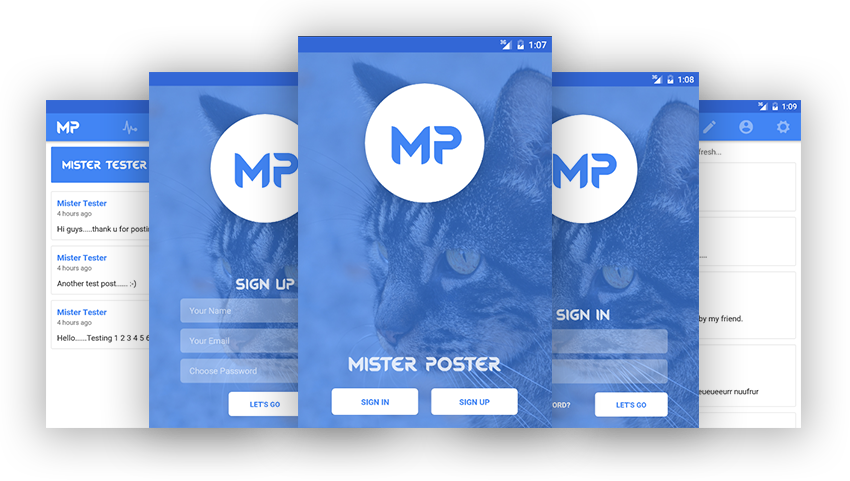
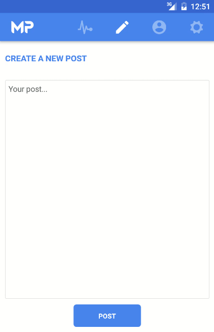

# Mister Poster

#### A social app with Universal Timeline where you can share your thoughts to everyone. No friendship needed!!

Download the APK : [Installable APK](https://github.com/shoumma/Mister-Poster/raw/master/apk-releases/mister-poster.apk)

## Built With
 - [React Native](https://facebook.github.io/react-native/)
 - [Redux](https://github.com/reactjs/redux)
 - [Redux Storage](https://github.com/michaelcontento/redux-storage) (with [async-storage engine](https://github.com/michaelcontento/redux-storage-engine-reactNativeAsyncStorage) for react native for application persistence)
 - [Firebase](https://firebase.google.com/)

This is my second application using react native. I'm really enjoying the technology. My main objective of this project was to learn how to integrate react native applications with Firebase. Firebase isn't properly supported yet for react native (third party logins like google, facebook, twitter still doesn't work due to webview requirement), but it have enough support for creating amazing stand alone applications. The app is Android only. I'm on a Ubuntu machine and apple doesn't allow me to create apps for them.

I would really appricate any suggestions, feedback, PRs and Issues.

## Walkthrough
###Sign In / Sign Up View

The Sign-In/Sign-Up view is pretty straight forward. Component's own states (not the redux state) are maintained to display forms. I haved used the [LayoutAnimation](https://facebook.github.io/react-native/docs/layoutanimation.html) and [Animatable](https://github.com/oblador/react-native-animatable) almost everywhere to make things more interactive and interesting. The trick was to animate components while mounting and unmounting. I didn't use any form validation since that part is amazingly done by Firebase. I displayed the error message to the user that catches by the promises. The back-end stuffs of sign in / sign up / reset password, all are done by Firebase user authentication APIs.

###Home View

After a successful sign in or sign up, the user will be directed to the Home view. These view are created using the [navigator](https://facebook.github.io/react-native/docs/navigator.html) from react-native and maintained by redux state. Based on user's sign-in status, the user will be displayed the Home View or the Sign In / Sign Up View.

The Home View is consists of four tabs -

 - The Universal Timeline
 - Create New Post
 - Own Posts
 - Settings

These are swipeable tabs that are created by using the library [react-native-scrollable-tab-view](https://github.com/skv-headless/react-native-scrollable-tab-view). The top navigation bar is a customized one which I hacked from one of the examples of the library.

The "Universal Timeline" component is a scroll view with "pull to refresh" functionality by using the [refresh control](https://facebook.github.io/react-native/docs/refreshcontrol.html). All the data are coming from Firebase NoSQL database. The next "Create New Post" component is used for creating a new post to the timeline. "Own Posts" will display own post count and own posts. Long press on any post from "Own Post" component will alert the user about deleting that post. Lastly, the "Settings" component is used to Sign Out the user or Delete account.

## How to create your own copy of this app?
### Prerequisites
To create an own copy of this application, you have some prerequisites. They are -

 - [NodeJS](https://nodejs.org/en/) installed on your system.
 - [React Native](https://facebook.github.io/react-native/) installed on your system.
 - Have the [Android SDK](https://developer.android.com/studio/index.html) and paths set properly. 
 - An android emulator or real device to run the app.
 - A google account for having [Firebase Web](https://firebase.google.com/docs/web/setup) configuration.

### Make own copy
First clone the repository using:

    git clone https://github.com/shoumma/Mister-Poster.git

Then install the dependencies using:

    npm install

At this point you need to have the configurations for a Firebase App. Just go to [Firebase Console](https://firebase.google.com/docs/web/setup) and follow the instructions. Then open the file named `firebase.js` from the `src` folder. Add the Firebase configurations to the file. The file looks something like this:

    // import and configure firebase
    import * as firebase from 'firebase';
    
    const firebaseConfig = {
      apiKey: [YOUR API KEY],
      authDomain: [YOUR AUTH DOMAIN],
      databaseURL: [YOUR DATABASE URL],
      storageBucket: [STORAGE BUCKET],
    }
    export const firebaseApp = firebase.initializeApp(firebaseConfig)

Then run the React Native server using:

    react-native start

Open your emulator and wait until it completely boot up. Then run the following command to run the app on the emulator.

    react-native run-android
Now, you have your own copy of this application!

##License
[MIT License](https://github.com/shoumma/Mister-Poster/blob/master/LICENSE). Do whatever you want to do.

## Credits
I barely create the application. I just created the front end shell and done some integration with firebase. All the credits goes to all library creators and contributors to those libraries. I'm really grateful to all of them.

 - [React](https://facebook.github.io/react/)
 - [React Native](https://facebook.github.io/react-native/)
 - [React Native Animatable](https://github.com/oblador/react-native-animatable)
 - [React Native Scrollable Tab View](https://github.com/skv-headless/react-native-scrollable-tab-view)
 - [React Native Vector Icons](https://github.com/oblador/react-native-vector-icons)
 - [Redux](https://github.com/reactjs/redux)
 - [React Redux](https://github.com/reactjs/react-redux)
 - [Redux Storage](https://github.com/michaelcontento/redux-storage)
 - [Redux Storage Engine - React Native Async Storage](https://github.com/michaelcontento/redux-storage-engine-reactNativeAsyncStorage)
 - [Firebase](https://firebase.google.com/)
 - [Moment JS](http://momentjs.com/)
 - [Lodash](https://lodash.com/)
 

Made with ♥ by [Provash Shoumma](https://twitter.com/pshoumma)
